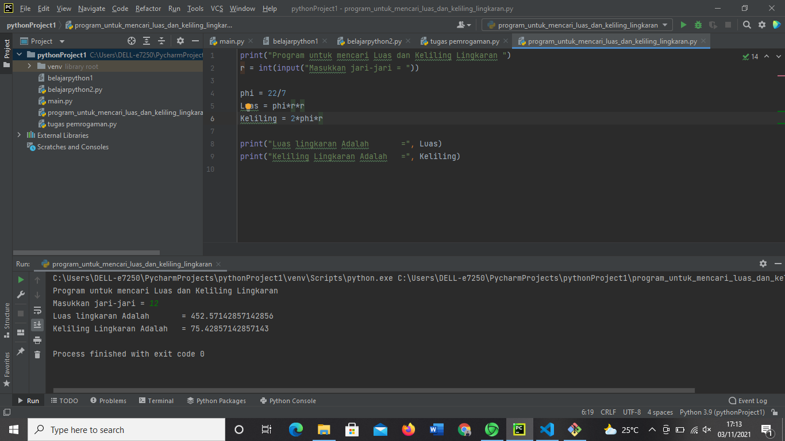
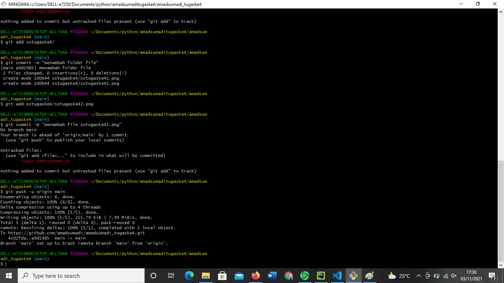
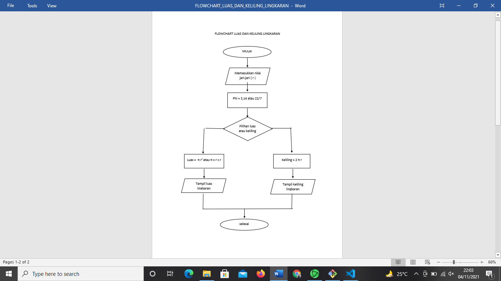

# amadsumadi_tugaske4
## Langkah-Langkah mencari Luas dan Keliling Lingkaran

### langkah mencari luas dan keliling di pycharm
pertama kita download dulu aplikasi pycharm tersebut

#### Langkah Mencari Luas Lingkaran
Luas lingkaran (L) = πr2 atau π x r x r
Penentuan nilai π menggunakan 22/7 atau 3,14.
ditentukan ketika ada angka yang diketahui terlebih dahulu,
Jika angka itu termasuk kelipatan 7 maka menggunakan 22/7,
sementara jika tidak termasuk kelipatan 7 berarti menggunakan 3,14.

#### Langkah Mencari Keliling Lingkaran 
Keliling Lingkaran (K) =  2 x π x r 
Penentuan nilai π menggunakan 22/7 atau 3,14.
ditentukan ketika ada angka yang diketahui terlebih dahulu,
Jika angka itu termasuk kelipatan 7 maka menggunakan 22/7,
sementara jika tidak termasuk kelipatan 7 berarti menggunakan 3,14.

adapun flowchartnya adalah sebagai berikut

